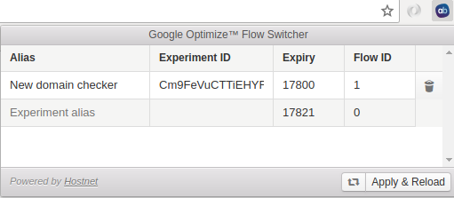

## Chrome extension for Google Optimize A/B experiments

This extension allows you to manipulate the flows of Google Optimize A/B tests.

 
### FAQ

**Why is the Google Optimize extension grayed out (inactive) on my website?**
> The extension only works if a cookie with the name `_gaexp` exists on your website. This cookie is placed by Google
> Optimize, so make sure it is loaded.
 
**What does "expiry" mean as it is shown in the interface?**
> Google Optimize uses days instead of seconds since 1970 to indicate how long an experiment is active for.
> This is basically a UNIX-timestamp represented in days.

**Why does this extension need permission for "tabs", "activeTab", "cookies", "storage" for *all* webpages?**
> The way this plugin works is by simply checking if the `_gaexp` cookie exists on the domain of the website you're
> visiting. If this cookie exists, the extension GUI will be made available to be used on that website. For this to
> work, the extension needs to know about your currently open tab, access the cookies of that tab.
> The `storage` is used to allow the user to assign aliases to experiments. As you can see in the screenshot above, an
> experiment ID doesn't say much.
